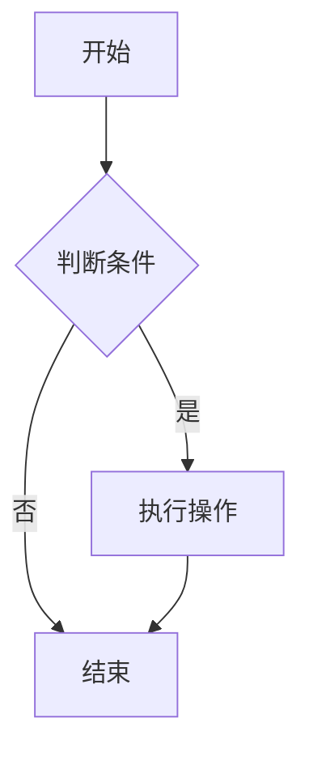

# MarkdownLite

一个轻量级的 Markdown 编辑器，支持 Mermaid 流程图语法。

## 功能特性

- ✅ 分窗编辑和预览（左右分屏）
- ✅ 实时预览
- ✅ Markdown 语法支持
- ✅ Mermaid 流程图支持
- ✅ 语法高亮
- ✅ 文件打开和保存
- ✅ 文件夹打开
- ✅ 简洁的界面设计
- ✅ 小巧的程序体积

## 技术栈

- **前端**: Vue 3 + Vite
- **后端**: Tauri 2.0 (Rust)
- **Markdown 渲染**: marked
- **Mermaid 渲染**: mermaid.js
- **语法高亮**: highlight.js

## 开发环境要求

- Node.js 18+ 
- Rust (通过 rustup 安装)
- 系统依赖：
  - macOS: Xcode Command Line Tools
  - Windows: Microsoft Visual Studio C++ Build Tools

## 环境安装步骤

### 1. 安装 Node.js

确保已安装 Node.js 18 或更高版本：

```bash
node --version
```

如果未安装，请访问 [Node.js 官网](https://nodejs.org/) 下载安装。

### 2. 安装 Rust

Tauri 需要 Rust 环境。在 macOS 上安装 Rust：

```bash
# 安装 rustup（Rust 工具链安装器）
curl --proto '=https' --tlsv1.2 -sSf https://sh.rustup.rs | sh

# 安装完成后，重新加载 shell 配置
source ~/.cargo/env

# 验证安装
rustc --version
cargo --version
```

**注意**: 如果遇到权限问题，可能需要先安装 Xcode Command Line Tools：

```bash
xcode-select --install
```

### 3. 安装项目依赖

```bash
npm install
```

## 开发运行

```bash
npm run tauri dev
```

## 构建应用

```bash
npm run tauri build
```

构建产物将位于 `src-tauri/target/release/bundle/` 目录。

## 使用说明

1. **打开文件**: 点击菜单栏的"打开文件"按钮，选择 `.md` 或 `.markdown` 文件
2. **打开文件夹**: 点击"打开文件夹"按钮选择文件夹（功能可扩展）
3. **编辑**: 在左侧编辑器窗格中编辑 Markdown 内容
4. **预览**: 右侧预览窗格会实时显示渲染结果
5. **保存**: 点击"保存"按钮保存当前内容

## Mermaid 示例

在 Markdown 中使用 Mermaid 语法：

````markdown

````

## 许可证

MIT
