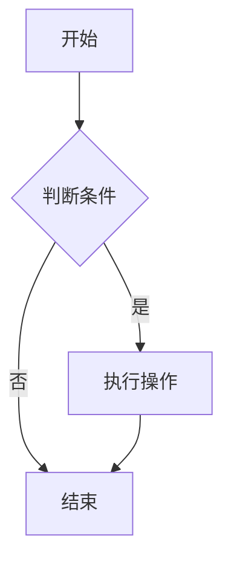

# MarkdownLite

一个轻量级的 Markdown 编辑器，支持 Mermaid 流程图语法。

## 功能特性

### 编辑器功能
- ✅ 分窗编辑和预览（左右分屏）
- ✅ 实时预览
- ✅ **CodeMirror 6 编辑器**，支持：
  - 行号显示
  - 代码折叠
  - 括号匹配
  - 自动缩进
  - Markdown 语法高亮
  - 撤销/重做
  - 大文件优化（防抖更新）

### Markdown 支持
- ✅ Markdown 语法支持
- ✅ **Mermaid 流程图支持**（实时渲染）
- ✅ 代码块语法高亮（highlight.js）
- ✅ VS Code Dark+ 暗色主题

### 文件操作
- ✅ 文件打开和保存
- ✅ 文件夹打开
- ✅ **最近打开文件列表**（自动记录，支持快速打开）
- ✅ **保存快捷键**（Cmd/Ctrl+S）
- ✅ **未保存退出提示**（防止意外丢失数据）

### 界面设计
- ✅ VS Code 风格的暗色主题
- ✅ 简洁的界面设计
- ✅ 小巧的程序体积
- ✅ **动态窗口标题**（显示当前文件名和未保存状态）
- ✅ **Dirty 状态提示**（保存按钮高亮显示未保存状态）

## 技术栈

- **前端**: Vue 3 + Vite
- **后端**: Tauri 2.0 (Rust)
- **编辑器**: CodeMirror 6（语法高亮、行号、代码折叠等）
- **Markdown 渲染**: marked
- **Mermaid 渲染**: mermaid.js (v10.9.0)
- **代码高亮**: highlight.js（预览窗格）
- **安全防护**: DOMPurify（XSS 防护）
- **主题**: VS Code Dark+ 暗色主题
- **测试框架**: Vitest + @vue/test-utils（67 个测试用例）

## 开发环境要求

- Node.js 18+ 
- Rust (通过 rustup 安装)
- 系统依赖：
  - macOS: Xcode Command Line Tools
  - Windows: Microsoft Visual Studio C++ Build Tools

## 环境安装步骤

### 1. 安装 Node.js

确保已安装 Node.js 18 或更高版本：

```bash
node --version
```

如果未安装，请访问 [Node.js 官网](https://nodejs.org/) 下载安装。

### 2. 安装 Rust

Tauri 需要 Rust 环境。在 macOS 上安装 Rust：

```bash
# 安装 rustup（Rust 工具链安装器）
curl --proto '=https' --tlsv1.2 -sSf https://sh.rustup.rs | sh

# 安装完成后，重新加载 shell 配置
source ~/.cargo/env

# 验证安装
rustc --version
cargo --version
```

**注意**: 如果遇到权限问题，可能需要先安装 Xcode Command Line Tools：

```bash
xcode-select --install
```

### 3. 安装项目依赖

```bash
npm install
```

## 开发运行

```bash
npm run tauri dev
```

## 构建应用

```bash
npm run tauri build
```

构建产物将位于 `src-tauri/target/release/bundle/` 目录。

## 使用说明

1. **打开文件**: 点击菜单栏的"打开文件"按钮，选择 `.md` 或 `.markdown` 文件
2. **打开文件夹**: 点击"打开文件夹"按钮选择文件夹（功能可扩展）
3. **最近文件**: 点击"最近"按钮查看最近打开的文件列表，支持快速打开
4. **编辑**: 在左侧编辑器窗格中编辑 Markdown 内容
   - 支持行号、代码折叠、括号匹配等高级编辑功能
   - 实时语法高亮
   - 支持大文件编辑（优化性能）
5. **预览**: 右侧预览窗格会实时显示渲染结果
   - 支持 Markdown 渲染
   - 支持 Mermaid 流程图实时渲染
   - VS Code 暗色主题
6. **保存**: 
   - 点击"保存"按钮保存当前内容
   - 使用快捷键 **Cmd/Ctrl+S** 快速保存
   - 未保存时，保存按钮会高亮显示"● 未保存"提示
   - 关闭窗口时如有未保存内容，会弹出确认提示
7. **窗口标题**: 窗口标题会显示当前文件名，未保存时会在文件名前显示 `*` 标记

## Mermaid 示例

在 Markdown 中使用 Mermaid 语法：

````markdown

````

## 启动示例文档

应用启动时会自动加载 `src/default-content.md` 作为示例文档，包含：
- Markdown 常用语法示例（标题/列表/表格/引用/代码块等）
- 多种 Mermaid 图表类型示例（流程图、序列图、甘特图、类图、状态图、饼图、ER 图等）

## 测试

项目包含完整的自动化测试覆盖（67 个测试用例）：

```bash
# 运行所有测试
npm run test:run

# 监听模式（开发时使用）
npm run test

# UI 模式（可视化测试结果）
npm run test:ui
```

测试覆盖范围：
- ✅ 状态管理（useDocument）
- ✅ 文件服务（fileService）
- ✅ Markdown 渲染（render/markdown）
- ✅ Mermaid 渲染（render/mermaid）

详细测试报告请参考 `TEST_COVERAGE.md`。

## 许可证

MIT
