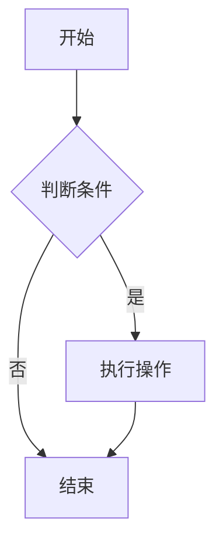
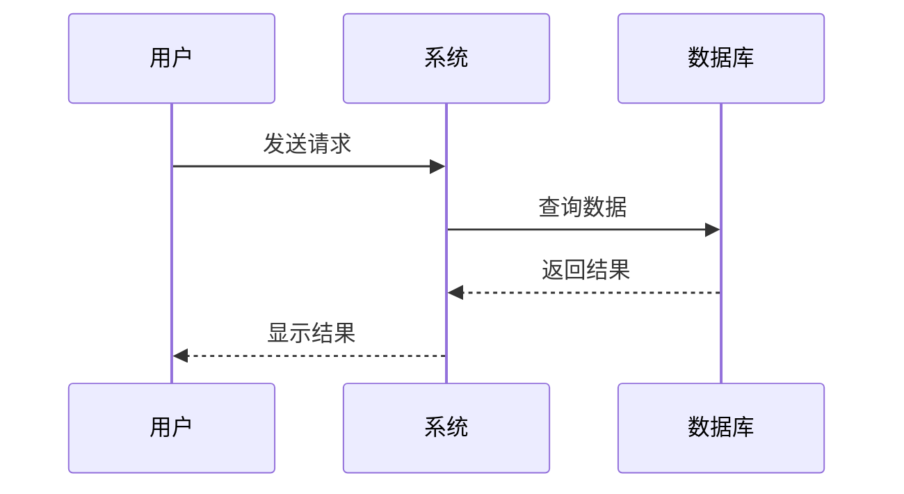
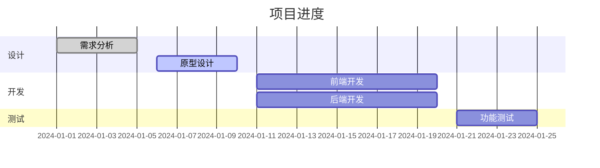
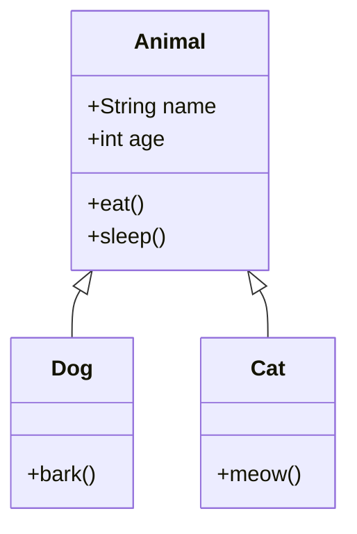
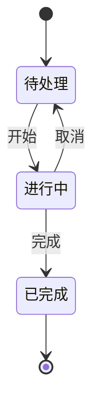
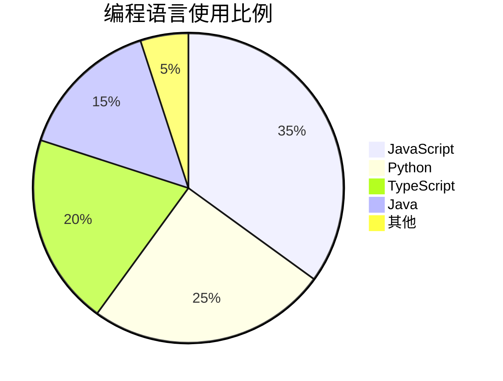
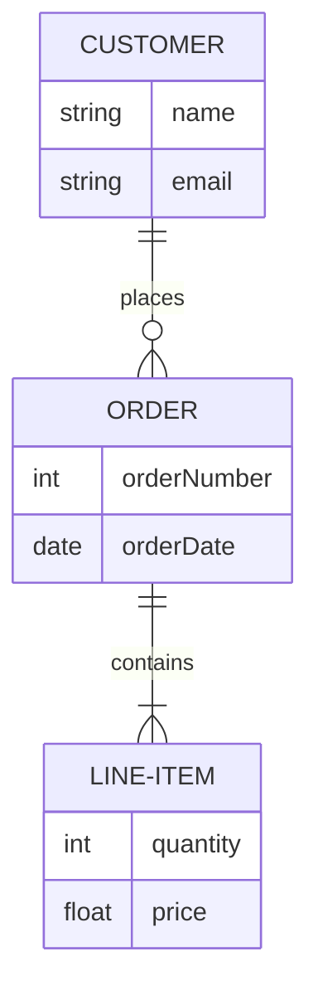

# 欢迎使用 MarkdownLite

一个轻量级的 Markdown 编辑器，支持 Mermaid 流程图语法和 VS Code 暗色主题。

---

## 📝 Markdown 基础语法

### 标题

# 一级标题 (H1)
## 二级标题 (H2)
### 三级标题 (H3)
#### 四级标题 (H4)
##### 五级标题 (H5)
###### 六级标题 (H6)

### 段落和换行

这是一个普通段落。Markdown 支持**粗体文字**、*斜体文字*和~~删除线~~。

这是另一个段落。可以包含`行内代码`，也可以包含[链接](https://example.com)。

### 强调

- **粗体文字** (`**粗体**` 或 `__粗体__`)
- *斜体文字* (`*斜体*` 或 `_斜体_`)
- ***粗斜体*** (`***粗斜体***`)
- ~~删除线~~ (`~~删除线~~`)

### 列表

#### 无序列表

- 项目 1
- 项目 2
  - 嵌套项目 2.1
  - 嵌套项目 2.2
- 项目 3

#### 有序列表

1. 第一项
2. 第二项
   1. 嵌套第一项
   2. 嵌套第二项
3. 第三项

#### 任务列表 (GFM)

- [x] 已完成的任务
- [ ] 未完成的任务
- [ ] 另一个未完成的任务

### 链接和图片

[文本链接](https://example.com)

[带标题的链接](https://example.com "链接标题")

自动链接: <https://example.com>


### 代码

行内代码: `const x = 10;`

代码块（无语法高亮）:

```
function hello() {
  console.log("Hello, World!");
}
```

#### 代码块语法高亮

JavaScript:

```javascript
function fibonacci(n) {
  if (n <= 1) return n;
  return fibonacci(n - 1) + fibonacci(n - 2);
}

console.log(fibonacci(10));
```

Python:

```python
def fibonacci(n):
    if n <= 1:
        return n
    return fibonacci(n - 1) + fibonacci(n - 2)

print(fibonacci(10))
```

TypeScript:

```typescript
interface User {
  name: string;
  age: number;
}

const user: User = {
  name: "John",
  age: 30
};
```

CSS:

```css
.container {
  display: flex;
  flex-direction: column;
  background: var(--bg);
  color: var(--text);
}
```

JSON:

```json
{
  "name": "MarkdownLite",
  "version": "1.0.0",
  "description": "A lightweight Markdown editor"
}
```

### 引用

> 这是一个引用块。
> 可以包含多行内容。
> 
> 也可以包含**粗体**和`代码`。

> 嵌套引用
> > 这是嵌套的引用
> > > 更深层的嵌套

### 表格 (GFM)

| 列1 | 列2 | 列3 |
|-----|-----|-----|
| 数据1 | 数据2 | 数据3 |
| 左对齐 | 居中 | 右对齐 |
| 更多数据 | 更多数据 | 更多数据 |

对齐方式:

| 左对齐 | 居中 | 右对齐 |
|:-------|:----:|-------:|
| 文本 | 文本 | 文本 |
| 更多 | 更多 | 更多 |

### 水平线

---

使用三个或更多连字符、星号或下划线创建水平线。

***

___

---

## 🎨 Mermaid 流程图示例

### 流程图 (Flowchart)



### 序列图 (Sequence Diagram)



### 甘特图 (Gantt Chart)



### 类图 (Class Diagram)



### 状态图 (State Diagram)



### 饼图 (Pie Chart)



### 实体关系图 (ER Diagram)



---

## 💡 编辑器功能

### CodeMirror 6 编辑器特性

- **行号显示**: 左侧显示行号，方便定位
- **代码折叠**: 点击行号旁的折叠图标可折叠代码块
- **括号匹配**: 输入括号时自动高亮匹配的括号
- **自动缩进**: 自动处理缩进，提高编辑效率
- **语法高亮**: 实时 Markdown 语法高亮
- **撤销/重做**: 支持 Ctrl+Z / Ctrl+Y (Windows) 或 Cmd+Z / Cmd+Shift+Z (macOS)
- **大文件优化**: 使用防抖更新，支持编辑大文件

### 快捷键

- `Ctrl/Cmd + Z`: 撤销
- `Ctrl/Cmd + Shift + Z`: 重做
- `Ctrl/Cmd + F`: 查找（如果支持）
- `Tab`: 缩进
- `Shift + Tab`: 取消缩进

---

## 🎯 使用技巧

1. **实时预览**: 左侧编辑，右侧实时预览
2. **Mermaid 图表**: 使用 \`\`\`mermaid 代码块创建流程图
3. **代码高亮**: 在代码块中指定语言名称即可获得语法高亮
4. **文件操作**: 使用菜单栏的"打开文件"和"保存"按钮管理文件

---

## 📚 更多信息

- Markdown 语法参考: [Markdown Guide](https://www.markdownguide.org/)
- Mermaid 文档: [Mermaid Documentation](https://mermaid.js.org/)

---

*享受使用 MarkdownLite！*
